# Touchline: build a football system, then watch it work

You coach Liverpool. **The Run** is the main mode: choose how the team plays, then take it through seven fixtures that get harder, picking one reward after every match and watching the build play out on the pitch. **Season mode** is the long game: a full Premier League season with training, transfers and finances. The football comes from the native Python engine; the Broadcast and Tactical views present the same match.

## Run locally

```sh
python3 -m venv .venv
.venv/bin/pip install -r requirements-dev.txt
TOUCHLINE_WORKERS=2 .venv/bin/python server.py
```

Open <http://127.0.0.1:8000>. The two-worker setting keeps the laptop responsive during league rounds and Analyst tests. Career progress stays in browser storage, with the existing server save/recovery path; match ledgers and Ghost League entries persist under `TOUCHLINE_DATA_DIR`.

The default is `TOUCHLINE_ENGINE=native`. The experimental continuous engine remains available with `TOUCHLINE_ENGINE=continuous`, but coaching, cards and analysis require native mode. `?debug=1` opens the engine debug panel; `?engine=mock` is a labelled development option.

## The Run — walkthrough

Seven fixtures, three strikes, one final. A run takes about 40 minutes. The design and its reasoning are in [docs/RUN_MODE.md](docs/RUN_MODE.md).

### 1. Start a run

A first visit opens a welcome screen explaining both modes. Home always offers **Start a run** or **Continue run**, with Season mode below it.

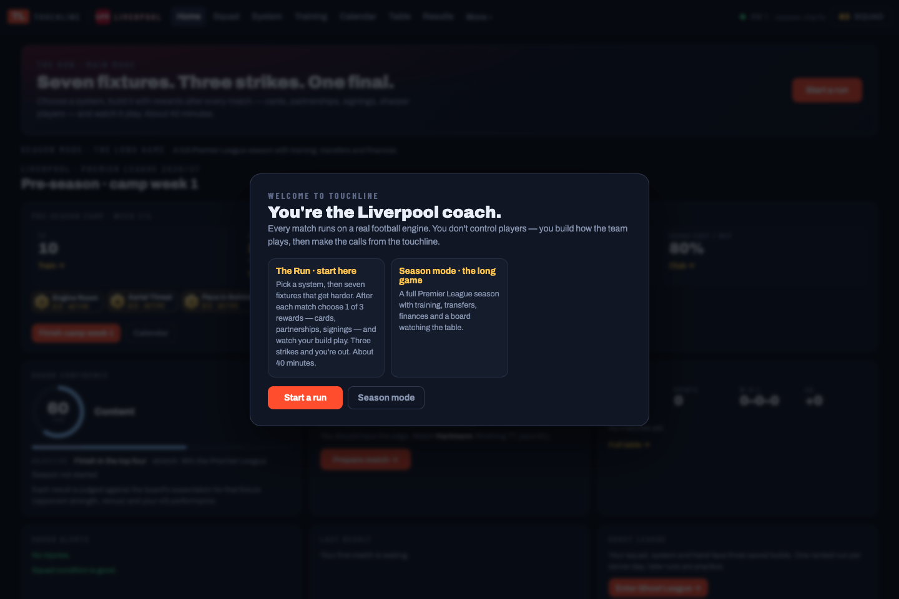

### 2. Pick 1 of 3 systems

Three of the eight systems are offered. Each card shows what the system asks of players, its starting cards and its fit with your squad, calculated by the Python build engine. You keep the system for the whole run. The starting deck is small: two signature cards plus four basics.

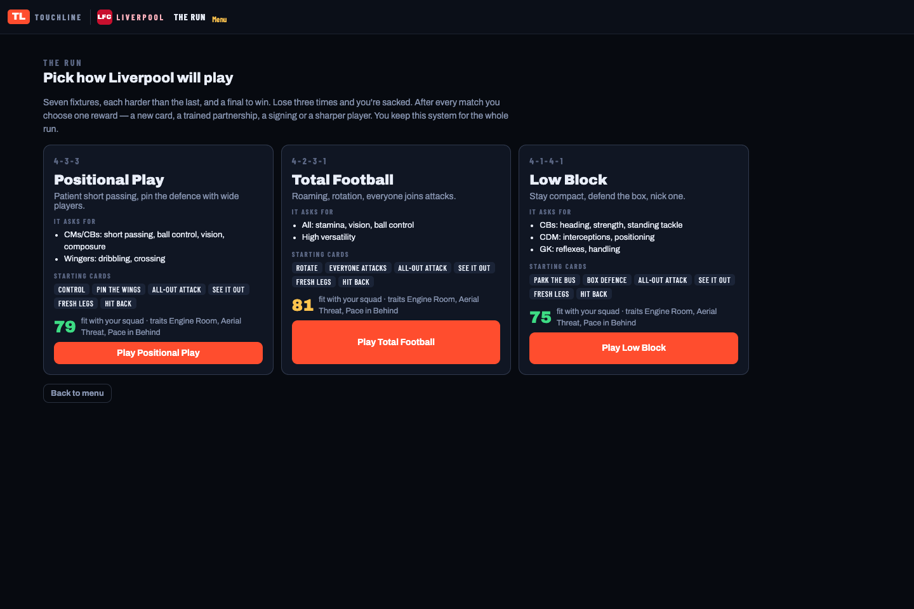

### 3. Choose the next opponent

Every round offers a **standard** fixture and an **elite** one. The elite opponent is a stronger club with a visible threat (here, *In form: their striker +6 Finishing, +6 Composure*) and a sharper CPU coach, but a win pays a **rare** reward. The final has one boss: the strongest club, every starter +3 Reactions and Composure. The ladder along the top shows every result so far.

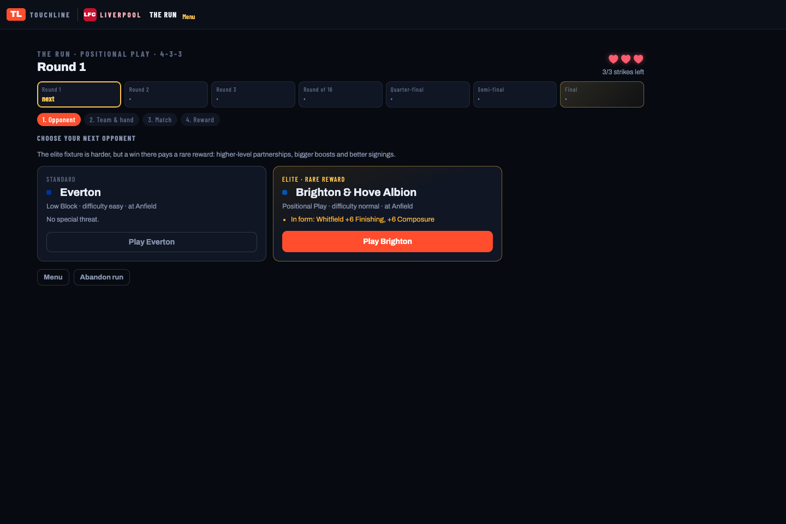

### 4. Set the XI and pick a hand of 5

The board shows each player's fit for his job in this system, the unit traits you have switched on, and your partnerships and sharpened players. Swap anyone with the dropdowns, or press **Best XI**. Pick 5 cards from your deck; the default hand favours build cards that can fire with this XI. Each card shows a one-line summary, and **Exact effect** expands the precise instructions it changes.

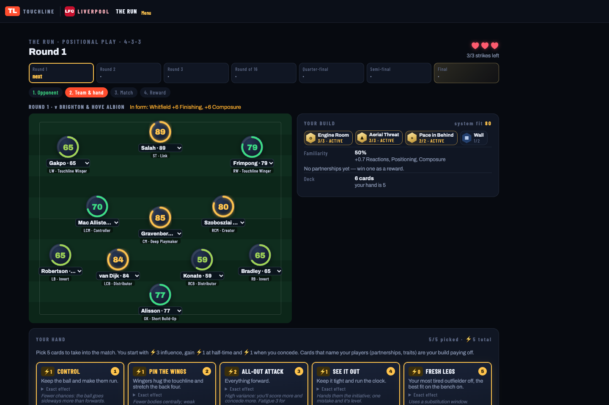

### 5. Watch the match and make your calls

Run matches play at **Highlights (8×)**. The view slows down for chances and around your build's moments, which are called out on the pitch: *ENGINE ROOM · Szoboszlai wins it back high — chance*, a partnership combo, a header from your Aerial Threat. These callouts are read from the match events after the fact and never change the football.

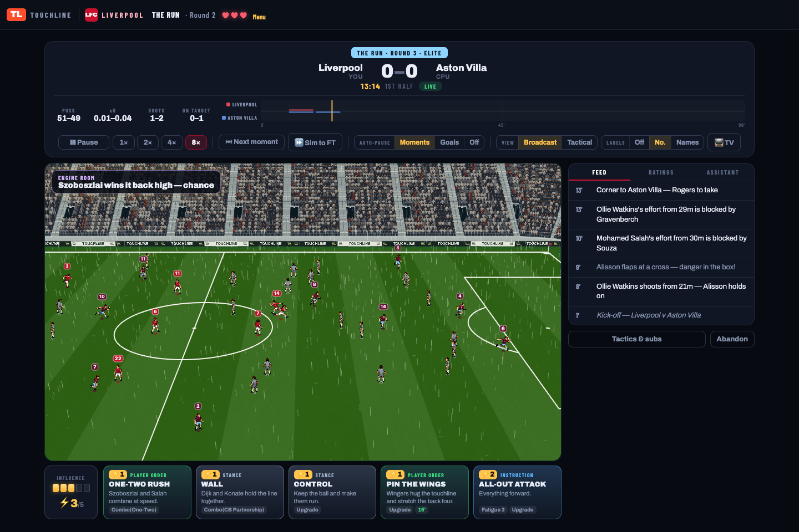

The match stops at decision beats (30', 60', 80'), at half-time, after goals and after red cards. Each stop shows the last 15 minutes and the cards in your hand that answer the situation. Here a partnership won earlier in the run has unlocked **ONE-TWO RUSH**, a card naming Szoboszlai and Salah, which is played at 31'. Influence starts at ⚡3 and rises by ⚡1 at half-time and ⚡1 when you concede. Manual tactics and substitutions are still available.

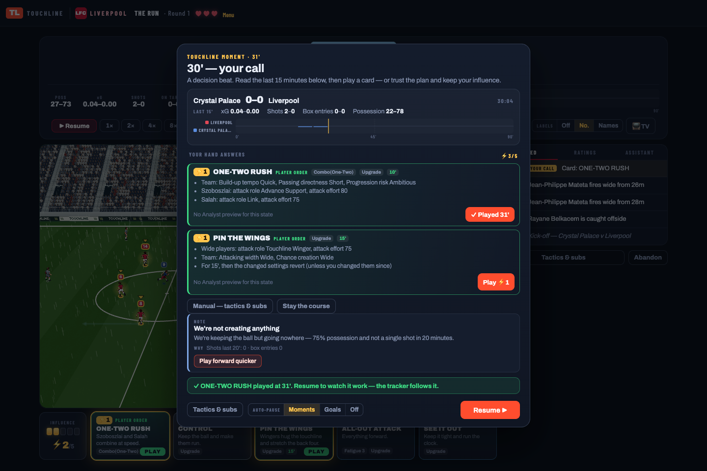

### 6. Result, then pick 1 of 3

A win offers 3 rewards, a draw 2, a loss 1. A loss costs a strike. In the final, a draw costs a strike too and the final is replayed. The result screen lists what your build did in the match. Rewards are the run's main decisions:
- a **new card**, including trait cards that only work while that trait is on the pitch;
- a **partnership** drilled to Lv2 or Lv3, which adds a combo card naming those players;
- a **signing** who fits your weakest slot;
- a **sharpened player**: +3 or +5 to the attributes his job demands;
- **system drills**, a **card upgrade**, or an **assistant** for +1 starting Influence.

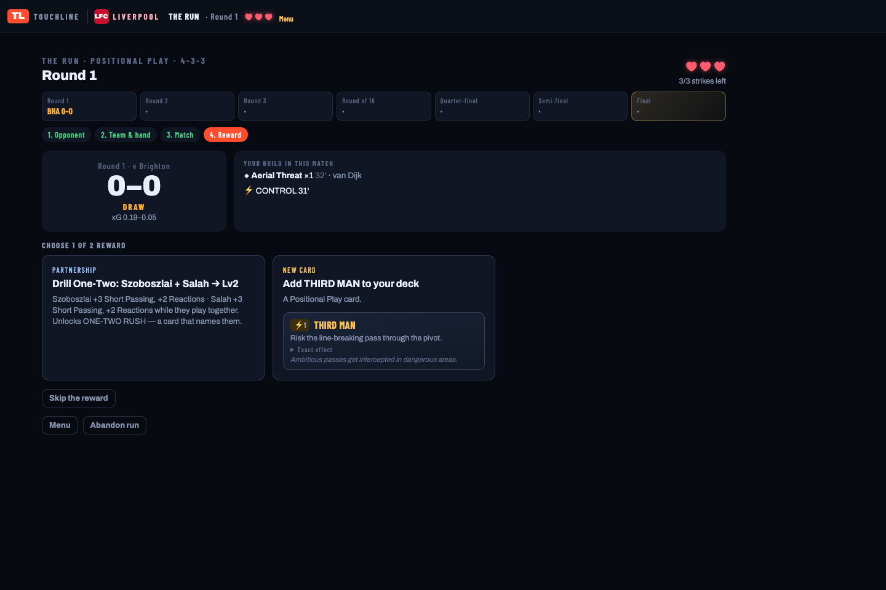

### 7. The build grows

A few rounds in, the board shows the partnerships, boosts and signings you chose, and the hand holds cards that are specific to them.

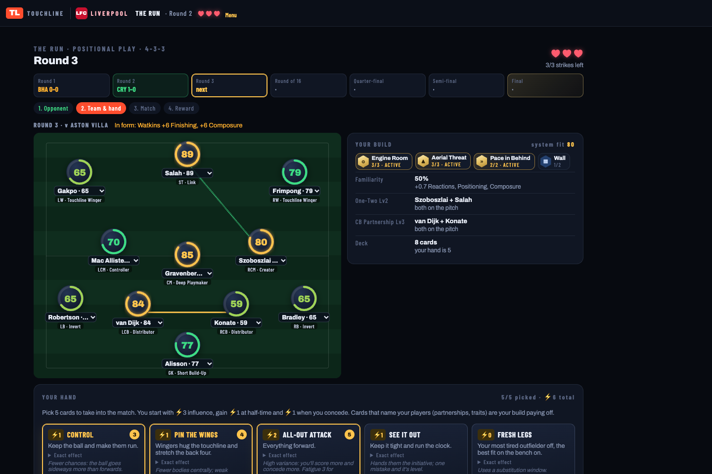

Win the final and the trophy is yours. Three strikes and the board sacks you; the run summary lists every match and every choice you made.

## Season mode — walkthrough

The long mode keeps the full v2 career: systems, training points, transfers, finances, the calendar and the Ghost League. Everyday tabs sit in the top bar; Players, Transfers, Club and Challenges are under **More**.

### 1. Build a system

Open **System**. Pick one of eight archetypes: Gegenpress, Positional Play, Wing Overload, Target Man, Counter Strike, Low Block, Inside Forwards or Total Football. Each sets a formation, the 13 team instructions and a job for every slot. You can inspect the exact instructions or build a custom system.

The board shows each player's fit for that particular job, the squad's system familiarity, active unit traits and up to four partnerships. A fast winger and a strong aerial striker ask for different supporting players. Fit comes from their individual attributes and condition, rather than Overall. Trait counters describe real attribute combinations; partnership readouts show the additional attribute modifiers. Traits add no hidden engine buff.

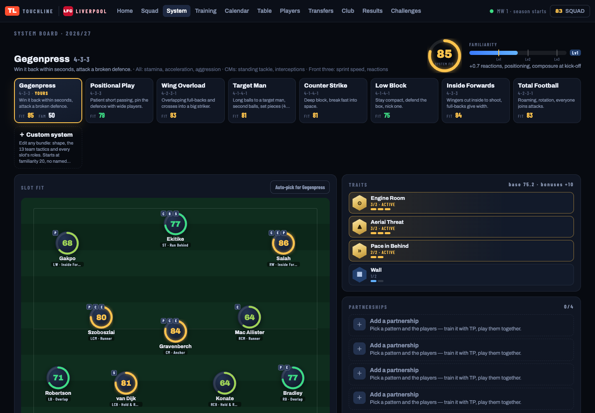

### 2. Spend training points deliberately

Open **Training**. A new career starts with a four-week camp: 10 TP a week, three friendlies and the summer transfer window. Once the season starts you receive 6 TP per ordinary week; congested weeks provide less time and recovery.

Preview a plan before spending: individual drills improve actual attributes, partnership drills develop combinations such as Overlap or Cross & Head, system work increases familiarity, and 2 TP upgrade a card once. Young players improve faster, drills have diminishing returns, and each trained attribute has a +4 seasonal cap. Heavy load costs starting energy; resting a player helps recovery.

Partnerships gain familiarity when their members start together and decay when they do not. Switching your system introduces a familiarity cost. Those constraints make rotation, continuity and the transfer market part of the same decision.

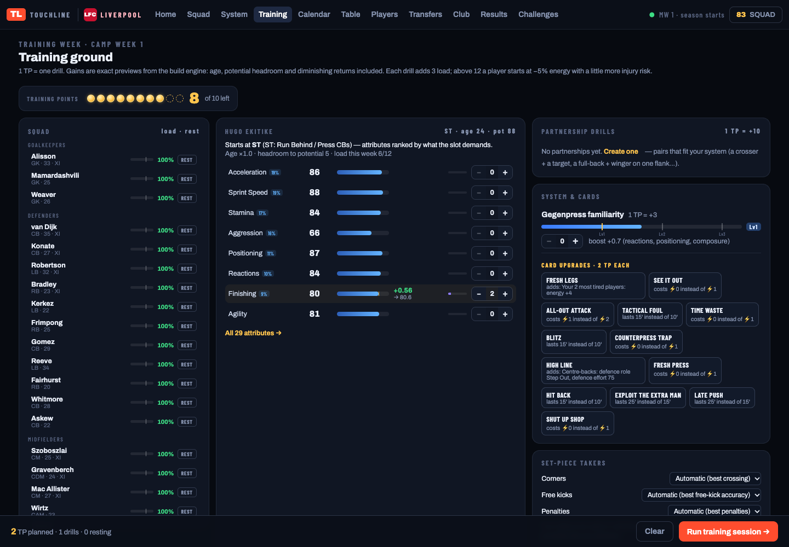

### 3. Recruit for the role and fund the squad

**Transfers** adds fit and traits to the existing bid/counteroffer flow. Scouting reveals uncertain attributes; a new signing arrives without partnership familiarity. **Club** shows wages, income, budgets and staff upgrades for coaching, fitness, analysis, scouting and the academy. Wage pressure can freeze further recruitment.

The **Calendar** includes summer camp, the January window and eight double-match weeks. At season end, review growth, contracts, youth intake, the board's verdict and the next budget; staff development carries forward.

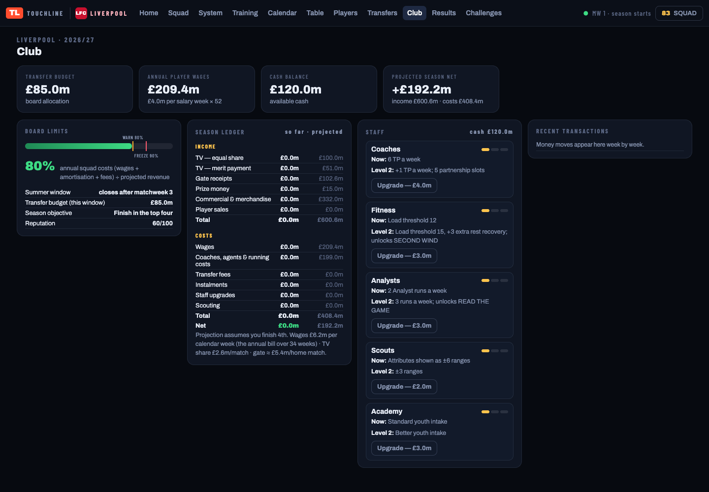

### 4. Prepare five concrete interventions

Open the next fixture. Read the opponent's scouting report, select the XI and bench, choose set-piece takers and a routine, then prepare a hand of five cards from your deck. The catalogue contains 52 cards across systems, combinations, universal actions, set pieces, reactions and staff unlocks.

Cards list the instructions they actually change: player roles, effort, formation, fatigue cost and duration. Combo cards require the relevant partners on the pitch; reaction cards state their trigger; Exhaust cards can be used once. The detailed view exposes the same effects that the Python compiler sends to the engine.

The **Analyst** can test the setup across 16 seeded futures, compare a saved alternative, or stress-test three private matchweeks against Fulham during camp. The stress test uses the camp week’s full Analyst budget and leaves your saved squad untouched. Statistical card previews report their source and uncertainty. An unavailable estimate is not presented as a measured benefit.

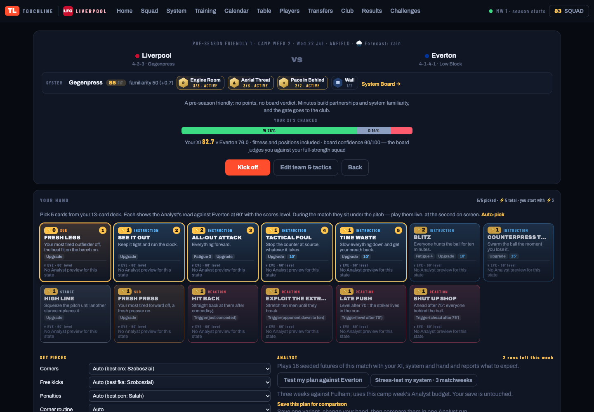

### 5. Watch and coach

Kick off in **Broadcast** for the stadium view, or switch to **Tactical** for the coach's board. Both use the presentation clock: score, commentary and decisions follow what has appeared on screen. Goals animate before the result banner; card plays and combinations have pitch feedback.

Your Influence starts at 3, is capped at 5, and gains a point at half-time and after conceding. Play a card live or pause to inspect it. The opposing coach has its own seeded card policy. Manual formation, instruction and substitution controls remain available, alongside speeds, next moment and sim to full time. V2 matches allow five substitutes in three in-play windows; same-clock changes share a window and half-time changes are exempt.

Commands take effect at the second you are watching. Timed effects expire, boosts disappear when the relevant player leaves, and the recorded command path supports deterministic rewind and replay.

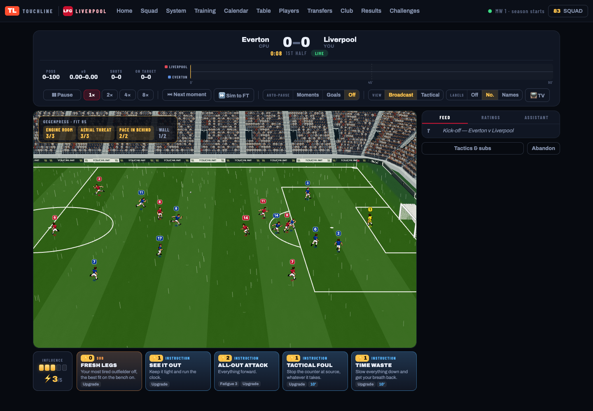

### 6. Review the build

At full time, compare the result with the chances, then inspect the system's pillars, partnership involvement, played cards and suggested next steps. **Decision Lab** uses paired alternate futures to estimate whether a decision helped; its average effect and the result of this particular match are distinct readouts. Rehearsal branches let you replay a passage without changing the career result.

The season finalises the remaining fixtures and persists the round before advancing. Training gains, availability and the saved starting plan survive reloads; substitutions during a match do not overwrite your career XI.

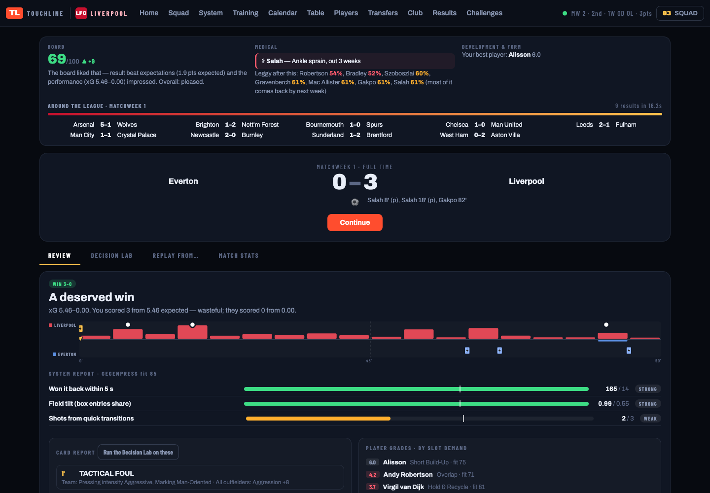

### 7. Test the squad in Ghost League

**Ghost League** submits a snapshot of your squad and build and plays three asynchronous opponents. The server sets the UTC day and awards one ranked run per anonymous player identity each day. Later runs are practice. Results and stars are computed by the server; scenario rehearsals remain available separately.

The first ranked attempt is reserved before simulation; a failed attempt remains consumed, preventing a retry from replacing it. Anonymous identity is not an account or a strong anti-cheat boundary. The initial opponent pool can use disclosed fallback squads while community entries accumulate.

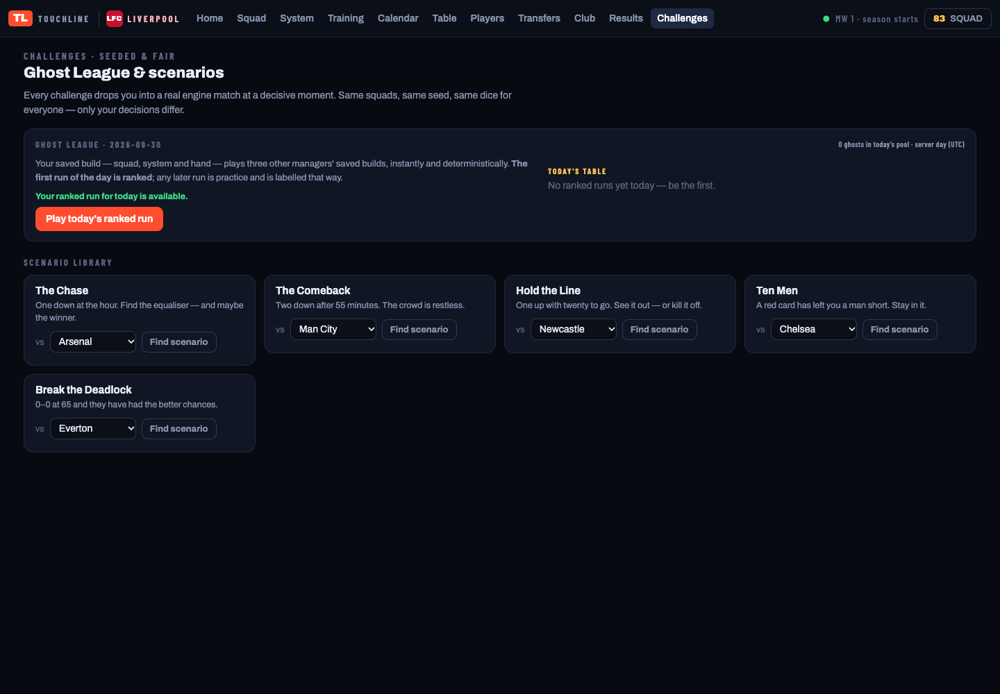

## Architecture and engine changes

| File | Responsibility |
|---|---|
| `build.py`, `data/systems.json`, `data/cards.json` | Python source of truth for fit, traits, training, familiarity and cards |
| `server.py`, `store.py` | Match API, persistence, recovery, build endpoints, Analyst budget and Ghost League |
| `management.py`, `labsim.py`, `coach.py` | Commands, seeded simulation futures and reports |
| `web/coach-run.js` | The Run: draft, ladder, rewards, run state (never written into the season save) |
| `web/coach-build.js`, `web/coach-career.js`, `web/coach-match.js` | Career building, season integrity and the live coaching flow |
| `sandbox/visual/embed.js`, `web/touchline.html` | Broadcast integration and presentation clock |
| `tools/balance/` | Paired card effects, build-value curves, matchup matrix, economy and feel checks |

**ENGINE CHANGES (v3, The Run):** run boosts are a separate kick-off modifier layer (`source: "boosts"`, capped at +10 per attribute); `influence_bonus` raises starting Influence (at most +2); `unlocks` lets rewarded cards into the deck; trait cards (`"trait"` field) target that trait's kick-off members and stop being playable when the trait drops below its count. All are input-gated, so requests without them behave as before.

**ENGINE CHANGES (v2):** E1 designated corner/free-kick/penalty takers; E2 match-scoped attribute modifiers and scheduled commands; E3 4-4-2, 3-4-3 and 5-3-2, including slot/remap support; E4 corner zone and target hints. These hooks are inert without their inputs. Nine frozen reference cases prove exact ledger identity with the hooks unused or explicitly unset. The old unsupported 4-2-3-1 ↔ 4-1-4-1 manager transition remains rejected.

The renderer does not resolve football, Overall does not decide events, and engine outcomes are not corrected to force a target league distribution. The full design and approved scope are in [Core Loop v2](docs/CORE_LOOP_V2_SPEC.md).

## Verify and measure balance

```sh
TOUCHLINE_WORKERS=2 .venv/bin/python -m pytest tests_integration.py tests_rc.py tests_coach.py tests_build.py tests_engine_v2.py -q
TOUCHLINE_WORKERS=2 .venv/bin/python -m pytest tests_ui -q
.venv/bin/python -m pytest simulator/tests -q
.venv/bin/python -m tools.balance.run all --scale smoke --workers 2
```

For long balance runs, use a scheduled remote CPU allocation and run the same CLI with `--scale full --workers N`. The harness caches intermediate matches/futures, checks source provenance and separates smoke from full results. Re-running an interrupted sweep resumes compatible work. The formation calibration command is `python simulator/validation/e3_formation_drift.py 200 2`.

The generated [balance report](tools/balance/report.md) records sample sizes, uncertainty and unmet gates. A smoke run verifies execution; it cannot certify card balance or league realism. The previously measured engine-only baseline had too many draws, no effective home advantage and concentrated striker scoring. Those findings must remain visible until a statistically sufficient current-build run resolves them. Economy experiments also disclose modelling assumptions. Loans and sell-on clauses remain the explicitly deferred Phase 2 work.

See [verification results](docs/V2_VERIFICATION.md) for the checks actually completed on this revision.
